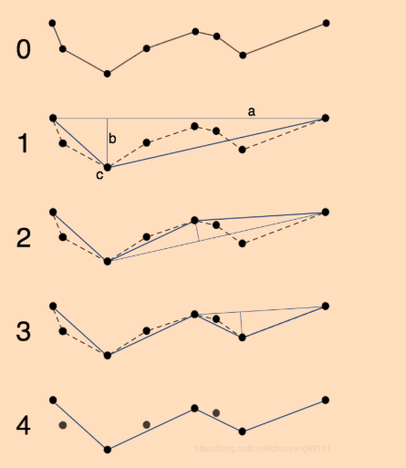
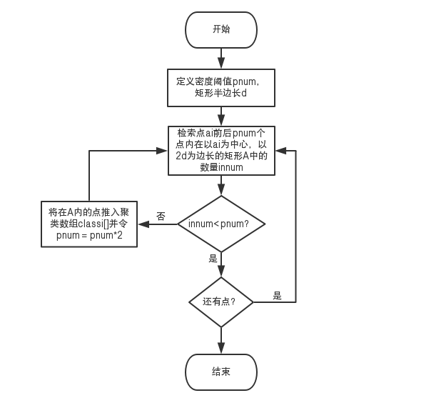

# GPS轨迹处理

> 随着 LBS 服务的广泛应用，出现了很多需要展示轨迹的场景。然而由于多路径效应、复杂环境以及 GPS 芯片质量参差不齐的影响，接收到的 GPS 数据都会含有噪声。只有处理过的 GPS 数据才能向用户展示。

## 不要输入无用数据

意味着当前后两个点的坐标是完全一致时，其为停留点，为无用数据。

## 异常数据的处理

当我们拿到一个轨迹序列，先要做的就是剔除所含的脏数据。我们可以采用两种方法来剔除或矫正数据。

### 基于几何距离的算法

该算法依赖于两个概念：

a. 已知地球上两个点的经纬度坐标，则可以根据球面空间计算出两点的最小球面距离d.（利用geodesy库实现），针对一个特定的物体，其产生的两个点之间的球面距离d必然是在一个范围（阈值）的，超过了这个范围就可以认定其存在问题。
b. 单位时间内物体的移动距离D=vt, 速度乘以时间。将d和D进行比较，这两个值应该是一致的，当两者偏离过大时，则说明数据是一个噪音数据。

### 基于速度约束的漂移点判断

a. 计算轨迹序列中的每个点的速度v1=d/ti-ti-1, 相关GPS定位接口可能会提供速度。
b. 对速度序列计算其均值与方差。
c. 对每个点的速度进行判读，若(速度-均值)^2>3方差，并且速度>均值，则该点是一个噪点。

### 噪点的处理

对于寻找到的噪点，我们可以直接删除该点，或使用前面一个点数据，以及使用前面3个点的数据对经纬度进行[样条插值](https://zhuanlan.zhihu.com/p/82619415)处理。

## 轨迹的压缩算法

### 轨迹序列聚类算法

终端时可能存在密集的集中区域点集的，这可能时来自于用户的短暂停留操作，也可能是GPS的定位效果不佳而导致的密集点。检测出停留点之后可以根据实际需求进行后续操作，为了简单起见直接将停留点删除。

### 道格拉斯-普克轨迹压缩方法

道格拉斯压缩算法，在曲线的压缩与简化中被广泛的使用，其核心在于将**曲线近似表示为一系列点的直线**，并减少点的数量的一种算法。

a. 设置阈值d，开始循环。
b. 循环查找离起始点连线（弦）最远的点c，其距离为b，若 `b<d` 则直接以起始点和点c连线为结果，反之将曲线以c点划分为前后两端；
c. 分别对前后两端进行迭代步骤b.
d. 得到最后结果。

注意这里的代码实现思路是递归，这样必然存在堆溢出问题，因此可考虑实现道格拉斯的非递归实现。

### 轨迹序列聚类算法

普通的聚类方法没有考虑轨迹是时间序列的特征，因此聚类效果不是很好，这里可以考虑一种基于时间序列的轨迹聚类算法。算法的执行过程如图所示：

该算法的优势体现为：

a、采用矩形作为查询范围，从而避免了大量的经纬度距离计算
b、利用轨迹是时间序列的特性，以当前点为中心查询前后一定范围内的点，减少循环次数。
c、将相邻的聚类进行合并可以提取更符合实际的停留点

## 轨迹的平滑算法

### 均值滤波

均值滤波是对待处理的当前点位，选择一个模板，该模板为其邻近的若干个点位组成，用模板的均值来替代原点位的坐标的方法。

A(x, y)=坐标点集合的平均值

均值滤波算法简单，计算速度快；但是对异常值较为敏感，如出现偏差较大的点使用均值滤波会对它相邻的一些数据产生影响，即，均值滤波对椒盐噪声抑制效果不好。

### 中值滤波

中值滤波方法是，对待处理的当前点位，选择一个模板，该模板为其邻近的若干个点位组成，对模板的点位由小到大进行排序，再用模板的中值来替代原点位的坐标的方法。

A(x, y)=坐标点集合的中值

中值滤波抑制效果很好，轨迹走势基本保持，对椒盐噪声剔除效果明显；但是对高斯噪声的抑制效果不是很好。（中值滤波也可以用来做第一步的漂移点位剔除）

### 卡尔曼滤波

卡尔曼滤波的关键在于合理的理解克尔曼滤波。可以[参考](https://www.zhihu.com/question/23971601)。

但在我们的系统中我们利用卡尔曼滤波做了什么呢？解决的是如何从多个不确定数据中提取相对精确的数据。我们能够获取的数据包括GPS数据、加速度计数据、陀螺仪数据，这三者都能给到当前的位置信息，但都会包含到一些不确定的因素。如果综合上述三者的信息，可以得到比单独一个信息来源更精确的结果。
